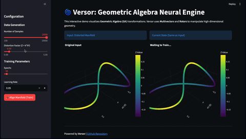
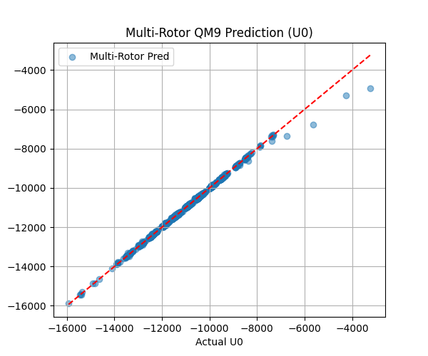
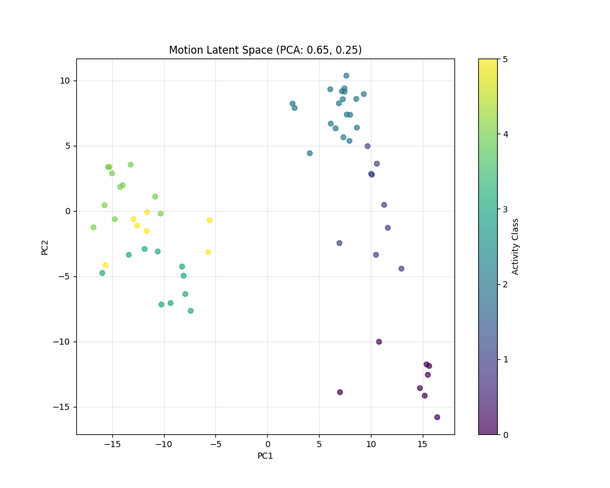

# Versor: A PyTorch Framework for Geometric Algebra Deep Learning

[](LICENSE) [](https://www.python.org/downloads/) [](https://pytorch.org/)

> **"There is a ceiling above standard Deep Learning that no one saw. Versor opens the door above it."**


## ⚡️ At a Glance

**Versor** replaces standard matrix multiplications with **Geometric Algebra (Rotor)** operations to preserve the topological structure of data.

| Benchmark | Metric | Performance | Note |
| :--- | :--- | :--- | :--- |
| **QM9** (Molecular) | MAE | **7.64 meV** | Trained **< 1 hour** on single 4090 |
| **QM9** (Inference) | Latency | **5.8 ms / molecule** | Real-time on **CPU (M4)** |
| **Motion** (UCI-HAR) | Accuracy | **~100%** | Grade Purity 0.9957 |
| **Architecture** | Params | **Lightweight** | $O(n)$ scaling via Cayley caching |

**Versor** is a PyTorch framework for **Geometric Algebra Deep Learning**. It provides the building blocks for the **Geometric Blade Network (GBN)** and **Multi-Rotor GBN** — model architectures that go beyond unconstrained linear transformations, using pure, manifold-aligned geometric rotations via Clifford Algebra and Rotors.

## Core Idea

Rotors ( $R = \exp(-B/2)$ ) perform pure geometric rotations via the sandwich product ($x \to RxR\tilde{}$), preserving manifold structure where standard weight matrices may inadvertently deform it.

## Key Features

*   **Metric-Agnostic Kernel**: Supports Euclidean $Cl(p, 0)$, Minkowski/Hyperbolic $Cl(p, q)$, and Projective algebras out of the box.
*   **Geometric Layers**: `RotorLayer`, `MultiRotorLayer`, `CliffordLinear`, `CliffordGraphConv`, `CliffordLayerNorm`.
*   **GBN Architectures**: `GeometricBladeNetwork` (single-rotor GBN), `MultiRotorModel` (multi-rotor GBN), `MoleculeGNN` / `MultiRotorQuantumNet` (graph GBN), `MotionManifoldNetwork` (alignment GBN).
*   **Novel Activations**: `GeometricGELU` (magnitude-based), `GradeSwish` (per-grade gating).
*   **Automatic Metric Search**: Finds optimal $(p, q)$ signature based on data topology.
*   **Geometric Sparsity**: `prune_bivectors` for compression of geometric layers.

## Why Versor?

### 1. Inherently Explainable AI (White-Box by Design)
Standard deep learning models are black boxes of millions of uninterpretable scalars. In Versor, every learnable parameter is a **Bivector**, which has a direct geometric meaning (a specific plane of rotation). This transparency offers a path to **Interpretability by Design**, where the model's internal reasoning can be visualized as clear geometric transformations rather than abstract weights.

### 2. A Grand Unified Theory for AI Architectures
Computer Vision, NLP, and Physics-ML currently rely on fragmented architectures. Versor’s **Metric-Agnostic Kernel** unifies these domains under a single mathematical framework. By simply changing the signature $(p, q)$, the same engine processes:
* **3D Euclidean Geometry** (Robotics, Molecules)
* **Minkowski Spacetime** (Relativistic Physics)
* **High-Dimensional Manifolds** (LLM Latent Spaces)
This represents a step toward a **General Geometric Intelligence** that transcends specific domains.

## Installation

Versor requires Python 3.9+ and PyTorch.

```bash
# Clone the repository
git clone https://github.com/Concode0/Versor.git
cd Versor

# Install core dependencies
uv sync

# Install with optional dependency groups
uv sync --extra viz          # matplotlib, seaborn, scikit-learn, plotly, imageio
uv sync --extra examples     # transformers, pillow, scikit-learn, matplotlib
uv sync --extra graph        # torch-geometric (for molecular GNN tasks)
uv sync --extra demo         # streamlit, plotly
uv sync --extra all          # everything
```

## Quick Start

### Using Versor Layers in Your Own Model

```python
import torch
from core.algebra import CliffordAlgebra
from layers.rotor import RotorLayer
from layers.linear import CliffordLinear
from functional.activation import GeometricGELU

# Create a 3D Euclidean Clifford Algebra
algebra = CliffordAlgebra(p=3, q=0)

# Build a model with geometric layers
rotor = RotorLayer(algebra, channels=4)
linear = CliffordLinear(algebra, in_channels=4, out_channels=8)
activation = GeometricGELU(algebra, channels=8)

# Input: [Batch, Channels, 2^n] multivectors
x = torch.randn(32, 4, algebra.dim)
out = activation(linear(rotor(x)))
```

### Running Tasks via CLI

Versor uses **Hydra** for configuration management:

```bash
# Run a task
uv run main.py task=qm9 training.epochs=100
uv run main.py task=motion training.epochs=100
uv run main.py task=semantic training.epochs=200

# Override parameters
uv run main.py task=qm9 algebra.device=cuda training.lr=0.001
```

### Interactive Demo (Streamlit)



```bash
streamlit run examples/demo.py
```

## Benchmarks

### QM9 (Molecular Property Prediction)
**Task**: Predict the internal energy ($U_0$) of small molecules using the Multi-Rotor (Geometric FFT) architecture.

| Metric | Value |
|--------|-------|
| **Algebra** | $Cl(3, 0)$ (3D Euclidean) |
| **Network** | MultiRotorQuantumNet |
| **Num Rotors** | 12 |
| **Validation MAE** | **7.6468** |
| **Avg Inference Time (CPU)** | **5.8439 ms / molecule** |
| **Training Time** | **< 1 hour** on Single 4090 |



```bash
# Train from scratch
uv run main.py task=multi_rotor_qm9 training.epochs=100

# Evaluate pretrained model
uv run main.py task=multi_rotor_qm9 training.epochs=0 checkpoint=multi_rotor_qm9_best.pt
```

> Note on Convergence & Efficiency: The current 7.6468 meV was achieved in just 100 epochs, and training was intentionally halted before reaching a plateau.
> We identified that gradient descent through standard matrix-based mixing introduces infinitesimal manifold deformations that counteract the pure isometric unbending of the GBN — a limitation we aim to resolve by replacing CliffordLinear with pure rotor compositions.

### Motion Alignment (UCI-HAR)
**Task**: Align high-dimensional motion data into a linearly separable latent space using geometric rotation.

| Metric | Value |
|--------|-------|
| **Algebra** | $Cl(4, 0)$ (Optimized via MetricSearch) |
| **Network** | MotionManifoldNetwork (Rotor Alignment) |
| **Latent Accuracy** | **~100%** |
| **Latent Grade Purity** | 0.9957 |



```bash
uv run main.py task=motion training.epochs=100
```

### Semantic Disentanglement (20 Newsgroups)
**Task**: Test whether a rotor can geometrically "unbend" the semantic manifold — pushing meaning into the grade-1 (vector) subspace while reconstructing faithfully.

| Metric | Value |
|--------|-------|
| **Algebra** | $Cl(6, 0)$ (6D Euclidean) |
| **Dataset** | 20 Newsgroups (full corpus) |
| **Network** | SemanticAutoEncoder (Encoder → BladeSelector → Decoder, each with RotorLayer) |
| **Input** | BERT [CLS] → PCA(48) → 8-channel multivectors |
| **Grade Purity** | **100%** (all energy in grade-1 vectors) |
| **Reconstruction Loss** | **~0.0** |
| **Noise Robustness** | 0.003 @ 5%, 0.024 @ 10%, 0.148 @ 20% |

```bash
uv run main.py task=semantic training.epochs=200
```

> First run downloads BERT model + 20 Newsgroups and caches embeddings to `data/newsgroups/`.

## Examples (Synthetic/Demo Tasks)

Synthetic experiments demonstrating GA concepts are in the `examples/` directory:

```bash
# Run synthetic tasks
uv run python -m examples.main task=manifold training.epochs=500
uv run python -m examples.main task=hyperbolic training.epochs=500
uv run python -m examples.main task=sanity
```

| Example | Algebra | Description |
|---------|---------|-------------|
| **Manifold** | $Cl(3,0)$ | Flatten a figure-8 manifold (100% topology restoration) |
| **Hyperbolic** | $Cl(1,1)$ | Reverse a Lorentz boost in Minkowski spacetime |
| **Sanity** | $Cl(3,0)$ | Verify algebra correctness (identity learning) |

## Configuration

Configuration files are in `conf/` (main tasks) and `examples/conf/` (synthetic tasks).

```bash
# Override any parameter from CLI
uv run main.py task=qm9 algebra.p=4 training.lr=0.001
```

## Project Structure

```
Versor/
├── core/               # Math kernel (CliffordAlgebra, metric, visualizer)
├── layers/             # Neural layers (Rotor, MultiRotor, Linear, GNN, Norm)
├── functional/         # Activations (GeometricGELU, GradeSwish) & losses
├── models/             # GBN architectures (single-rotor, multi-rotor, graph, motion)
├── tasks/              # Task runners (QM9, Motion, Semantic)
├── datasets/           # Data loaders (QM9, HAR, Newsgroups)
├── conf/               # Hydra configs for main tasks
├── docs/               # Documentation (philosophy, tutorial, math, FAQ)
├── examples/           # Synthetic demos and interactive Streamlit app
│   ├── tasks/          # Manifold, Hyperbolic, Sanity
│   ├── datasets/       # Synthetic data generators
│   └── conf/           # Hydra configs for example tasks
├── tests/              # Unit & property tests
└── main.py             # CLI entry point
```

## Roadmap

- [ ] Native CUDA Kernels for $Cl(3,0)$ and $Cl(1,3)$
- [ ] JIT Compilation with metric-aware operation graph optimization
- [ ] Geometric Transformer (GAT): Fully geometric attention mechanism
- [ ] Multi-head & Dynamic Rotors: Input-dependent rotation axes
- [x] **Automatic Metric Search**: Self-optimizing signature ($p, q$)
- [x] **Automatic Bivector Pruning**: Geometric sparsity-driven compression
- [x] **CliffordGraphConv**: Geometric signal processing on graphs (QM9)
- [x] **Multi-Rotor GBN**: Spectral decomposition with overlapping rotors

## Documentation

*   [**Philosophy**](docs/philosophy.md): Why Geometric Algebra? The "unbending" paradigm.
*   [**Tutorial**](docs/tutorial.md): Step-by-step guide to building with Versor.
*   [**Mathematics**](docs/mathematical.md): Clifford Algebra, Rotors, Metric Signatures.
*   [**FAQ**](docs/faq.md): Common questions and troubleshooting.
*   [**Milestone**](docs/milestone.md): Roadmap — completed and upcoming work.

## License & Intellectual Property

This project is licensed under the **Apache License 2.0**.

**Notice on Patents**:
The core GBN architecture is covered by **KR Patent Application 10-2026-0023023**.
By releasing this under Apache 2.0, we provide a **perpetual, royalty-free patent license** to any individual or entity using this software.

## Citation

```bibtex
@software{kim2026versor,
  author = {Kim, Eunkyum},
  title = {Versor: Universal Geometric Algebra Neural Network},
  url = {https://github.com/Concode0/versor},
  version = {0.1.0},
  year = {2026},
  month = {2},
  license = {Apache-2.0},
  note = {ROK Patent Application 10-2026-0023023 (Geometric Blade Networks)}
}
```

## Technical Note: Current State of CliffordLinear
Unlike standard neural networks, which must use spectral normalization, weight clipping, or gradient penalties to force Lipschitz constraints (often approximately), Versor's RotorLayers satisfy this property by construction, while GeometricGELU and CliffordLayerNorm explicitly decouple and control only the Radial Scale, preserving angular integrity.

Active Development: We are currently transitioning to a Pure Geometric Update paradigm. This involves:

Replacing matrix-based mixing with a Composition of Irreducible Rotors.

Moving all weight updates from Euclidean space to the Bivector Manifold (Lie Algebra).
