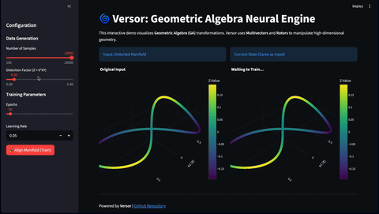

# Versor: A PyTorch Framework for Geometric Algebra Deep Learning

> [!IMPORTANT]
> **Notice: No Affiliation with arXiv:2602.10195**
>
> This project (**Versor**) is the original, independent research work of Eunkyum Kim.
> We have **no affiliation, association, or connection** with the paper titled *"Versor: A Geometric Sequence Architecture"* (arXiv:2602.10195) or its authors.
>
> Any claims of performance or hardware implementations made in that paper (under the name 'VersorAI') do not represent this project. We have formally reported the misuse of our project's name and identity to the relevant institutions.

[](LICENSE) [](https://www.python.org/downloads/) [](https://pytorch.org/)

> **"There is a ceiling above standard Deep Learning that no one saw. Versor opens the door above it."**



## At a Glance

**Versor** replaces standard matrix multiplications with **Geometric Algebra (Rotor)** operations to preserve the topological structure of data. It provides the building blocks for the **Geometric Blade Network (GBN)** — model architectures that go beyond unconstrained linear transformations, using pure, manifold-aligned geometric rotations via Clifford Algebra and Rotors.

| Task                                       | Algebra             | Key Metric             | Result                | Note                               |
| :----------------------------------------- | :------------------ | :--------------------- | :-------------------- | :--------------------------------- |
| **Symbolic Regression** (First_Principles) | $Cl(4,0)$           | Median R²              | 0.9525                | Iterative geometric unbending      |
| **MD17** (Molecular Dynamics)              | $Cl(3,0,1)$ PGA     | Energy MAE / Force MAE | —                     | Experimental                       |
| **LQA** (Logical Query Answering)          | $Cl(4,1)$ CGA       | Chain / Negation       | 100% @len1–13 / 64.6% | Geometric ALU on frozen embeddings |
| **DEAP EEG** (Emotion)                     | $Cl(3,1)$ Minkowski | F1 / RMSE              | —                     | Cross-subject LOSO                 |

## Core Idea

Rotors ( $R = \exp(-B/2)$ ) perform pure geometric rotations via the sandwich product ($x \to R x \tilde{R}$), preserving manifold structure where standard weight matrices may inadvertently deform it.

## What's Built

- **Cl(p,q,r) kernel** with null dimension support for Projective GA
- **Signature-aware exp map** — closed-form elliptic/hyperbolic/parabolic (no Taylor series)
- **Hermitian metrics** for positive-definite inner products in any signature
- **Multi-Rotor GBN** with K weighted rotors (geometric spectral decomposition)
- **Rotor Gadget** — parameter-efficient linear replacement (~63% param reduction)
- **Automatic Metric Search** via GeodesicFlow + bivector energy analysis → (p,q,r) discovery
- **CGA embedding** Cl(n+1,1) for conformal geometric algebra
- **Riemannian Adam** optimizer — Adam momentum in the Lie algebra (bivector space)
- **Geometric activations** — GeometricGELU, GradeSwish, GeometricSquare
- **Rotor-to-symbolic-formula translation** — direct readout of trained weights as equations
- **Iterative geometric unbending** — 4-phase SR pipeline with blade rejection
- **CliffordGraphConv** for molecular graphs
- **Bivector pruning** for geometric sparsity
- **GeometricTransformerBlock** with entropy-gated attention

For code examples of each innovation, see [docs/innovations.md](docs/innovations.md).

## Key Features

*   **Metric-Agnostic Kernel**: Supports Euclidean $Cl(p, 0)$, Minkowski $Cl(p, q)$, Projective $Cl(p, 0, r)$, and Conformal $Cl(n+1, 1)$ algebras out of the box.
*   **Geometric Layers**: `RotorLayer`, `MultiRotorLayer`, `CliffordLinear`, `CliffordGraphConv`, `CliffordLayerNorm`, `BladeSelector`, `RotorGadget`.
*   **Novel Activations**: `GeometricGELU` (magnitude-based), `GradeSwish` (per-grade gating), `GeometricSquare` (gated self-product).
*   **Automatic Metric Search**: Finds optimal $(p, q, r)$ signature based on data topology via GBN probes.
*   **Riemannian Optimization**: `RiemannianAdam` and `ExponentialSGD` with manifold retraction.
*   **Geometric Sparsity**: `prune_bivectors` for compression of geometric layers.

## Installation

Versor requires Python 3.9+ and PyTorch.

```bash
# Clone the repository
git clone https://github.com/Concode0/Versor.git
cd Versor

# Install core dependencies
uv sync

# Install with optional dependency groups
uv sync --extra viz          # matplotlib, seaborn, scikit-learn, plotly, imageio
uv sync --extra examples     # transformers, pillow, scikit-learn, matplotlib
uv sync --extra graph        # torch-geometric (for molecular GNN tasks)
uv sync --extra demo         # streamlit, plotly
uv sync --extra all_tasks    # All task dependencies (graph, pdbbind, weather, cad)
uv sync --extra all          # everything
```

## Quick Start

### Using Versor Layers in Your Own Model

```python
import torch
from core.algebra import CliffordAlgebra
from layers.primitives.rotor import RotorLayer
from layers.linear import CliffordLinear
from functional.activation import GeometricGELU

# Create a 3D Euclidean Clifford Algebra
algebra = CliffordAlgebra(p=3, q=0, device='cpu')

# Build a model with geometric layers
rotor = RotorLayer(algebra, channels=4)
linear = CliffordLinear(algebra, in_channels=4, out_channels=8)
activation = GeometricGELU(algebra, channels=8)

# Input: [Batch, Channels, 2^n] multivectors
x = torch.randn(32, 4, algebra.dim)
out = activation(linear(rotor(x)))
```

### Running Tasks via CLI

Versor uses **Hydra** for configuration management:

```bash
# Run tasks
uv run main.py task=sr training.epochs=100
uv run main.py task=md17 training.epochs=100
uv run main.py task=lqa probe=chain training.epochs=50
uv run main.py task=deap_eeg training.epochs=100

# Override parameters
uv run main.py task=sr algebra.p=4 training.lr=0.001
```

### Interactive Demo (Streamlit)


```bash
streamlit run examples/demo.py
```

## Tasks

### Symbolic Regression (SR)

Discovers closed-form symbolic formulas from numerical data using iterative geometric unbending.

| Property     | Value                                                                        |
| :----------- | :--------------------------------------------------------------------------- |
| **Algebra**  | $Cl(4,0)$                                                                    |
| **Pipeline** | probe → train → extract → subtract → refine (4 phases)                       |
| **Datasets** | [SRBench 2.0](https://arxiv.org/abs/2505.03977) (first_principles, blackbox) |
| **Result**   | Median R² = 0.9525 on 15 First Principles equations                          |

**Analysis:** While the median R² of 0.9525 on First Principles equations is a decent result, this is still an early version of the SR pipeline. Much of the underlying logic can be further improved, and performance can be enhanced through parameter tuning — for example, by redefining the entry condition for implicit mode. The current version of SR should therefore be understood primarily as a **structural proposal**: a demonstration that iterative geometric unbending is a viable and interpretable framework for symbolic regression. The most important properties of this approach are **interpretability** (formulas are read directly from trained rotor weights) and **physically plausible structure** (rotor composition mirrors the composition of physical symmetries). The current implementation suffers from numerical instability and difficulty handling high-dimensional input data, both of which are planned for improvement in future versions.

**Speed-to-Performance Ratio**: For the 12 first_principles datasets, the entire execution took roughly 5 minutes (avg. ~23s per dataset). This demonstrates a structurally different efficiency from existing Genetic Algorithm-based SR models, proving that Geometric Unbending computes laws deterministically rather than searching for them stochastically.

```bash
uv run main.py task=sr
```

### MD17 (Molecular Dynamics)

Multi-task energy + force prediction with conservative constraint ($F = -\nabla E$).

| Property      | Value                                                                                  |
| :------------ | :------------------------------------------------------------------------------------- |
| **Algebra**   | $Cl(3,0,1)$ — PGA for SE(3) rigid-body motions                                         |
| **Molecules** | aspirin, benzene, ethanol, malonaldehyde, naphthalene, salicylic acid, toluene, uracil |
| **Status**    | Experimental                                                                           |

```bash
uv run main.py task=md17
```

### LQA (Logical Query Answering)

A **geometric arithmetic logic device** (~228K params) that operates directly on frozen latent embeddings. Rather than building an end-to-end LLM, LQA isolates the question: *what can geometric algebra do to a latent space that flat linear algebra cannot?*

Each probe tests a specific algebraic operation — composition, asymmetry, negation — revealing both the power of the geometric approach and the hard ceiling imposed by flat embeddings.

| Property       | Value                                               |
| :------------- | :-------------------------------------------------- |
| **Algebra**    | $Cl(4,1)$ Conformal GA                              |
| **Probes**     | chain (CLUTRR), entailment (HANS), negation (BoolQ) |
| **Chain**      | 100% accuracy at all lengths 1–13                   |
| **Negation**   | 64.6% — orig 65.2%, neg 63.9% (gap 1.3%)            |
| **Entailment** | 52.6% — ent 81.4%, non-ent 23.8%                    |

**Chain (composition):** Perfect 100% accuracy across all chain lengths 1–13. Rotor composition $R_1 R_2 \cdots R_k$ naturally represents multi-hop relational chains — the algebraic structure matches the task structure exactly.

**Negation & Entailment (encoder ceiling):** These probes deliberately expose the limits of flat embeddings. MiniLM maps "Is X?" and "Isn't X?" to cosine similarity 0.967 — the embedding shifts only 18% of inter-question distance under negation. An MLP baseline on the same embeddings achieves 59.5% (vs GBN 64.6%) with a comparable 1.0% negation gap, confirming the gap is bounded by the encoder, not the geometric model. The entailment probe shows a similar pattern: the HANS adversarial set exploits lexical overlap heuristics that MiniLM's flat space cannot distinguish from genuine entailment. See `scripts/analyze_minilm_negation.py` for the full analysis.

**Next step:** Replace the frozen MiniLM encoder with a geometric embedding pipeline, removing the flat-space bottleneck entirely.

```bash
uv run main.py task=lqa probe=chain training.epochs=50
uv run main.py task=lqa probe=negation training.epochs=10
uv run main.py task=lqa probe=entailment training.epochs=10
```


### DEAP EEG (Emotion Classification)

EEG emotion classification using phase-amplitude representation in Minkowski algebra with mother manifold alignment across subjects.

| Property       | Value                                  |
| :------------- | :------------------------------------- |
| **Algebra**    | $Cl(3,1)$ Minkowski                    |
| **Input**      | 32-channel EEG + 8 peripheral channels |
| **Targets**    | Valence, Arousal, Dominance, Liking    |
| **Evaluation** | Cross-subject LOSO                     |

```bash
uv run main.py task=deap_eeg training.epochs=100
```


## Examples (Synthetic/Demo Tasks)

Synthetic experiments demonstrating GA concepts are in the `examples/` directory:

```bash
# Run synthetic tasks
uv run python -m examples.main task=manifold training.epochs=500
uv run python -m examples.main task=hyperbolic training.epochs=500
uv run python -m examples.main task=sanity
```

| Example        | Algebra   | Description                                             |
| :------------- | :-------- | :------------------------------------------------------ |
| **Manifold**   | $Cl(3,0)$ | Flatten a figure-8 manifold (100% topology restoration) |
| **Hyperbolic** | $Cl(1,1)$ | Reverse a Lorentz boost in Minkowski spacetime          |
| **Sanity**     | $Cl(3,0)$ | Verify algebra correctness (identity learning)          |

## Configuration

Configuration files are in `conf/` (main tasks) and `examples/conf/` (synthetic tasks).

```bash
# Override any parameter from CLI
uv run main.py task=sr algebra.p=4 training.lr=0.001
```

## Project Structure

```
Versor/
├── core/               # Math kernel (CliffordAlgebra, metric, search, decomposition, CGA)
├── layers/             # Neural layers (Rotor, MultiRotor, Linear, GNN, Norm, RotorGadget)
├── functional/         # Activations (GeometricGELU, GradeSwish, GeometricSquare) & losses
├── models/             # Task-specific architectures
│   └── sr/             # SR models (SRGBN, translator, unbender, grouper, estimator)
├── optimizers/         # Riemannian optimizers (RiemannianAdam, ExponentialSGD)
├── tasks/              # Task runners (SR, MD17, LQA, DEAP EEG)
├── datalib/            # Data loaders (PMLB, MD17, CLUTRR/HANS/BoolQ, DEAP)
├── conf/               # Hydra configs for main tasks
├── docs/               # Documentation
│   └── tasks/          # Per-task specifications (LQA, DEAP EEG)
├── examples/           # Synthetic demos and interactive Streamlit app
│   ├── tasks/          # Manifold, Hyperbolic, Sanity
│   ├── datasets/       # Synthetic data generators
│   └── conf/           # Hydra configs for example tasks
├── tests/              # Unit & property tests
└── main.py             # CLI entry point
```

## Documentation

*   [**Philosophy**](docs/philosophy.md): Why Geometric Algebra? The "unbending" paradigm.
*   [**Tutorial**](docs/tutorial.md): Step-by-step guide to building with Versor.
*   [**Mathematics**](docs/mathematical.md): Clifford Algebra, Rotors, Metric Signatures.
*   [**Innovations (Code Examples)**](docs/innovations.md): 10 code-illustrated innovations that make Versor unique.
*   [**FAQ**](docs/faq.md): Common questions and troubleshooting.
*   [**Roadmap**](docs/milestone.md): Upcoming work and research directions.

## License & Intellectual Property

This project is licensed under the **Apache License 2.0**.

**Notice on Patents**:
The core GBN architecture is covered by **KR Patent Application 10-2026-0023023**.
By releasing this under Apache 2.0, we provide a **perpetual, royalty-free patent license** to any individual or entity using this software.

## Citation

```bibtex
@software{kim2026versor,
  author = {Kim, Eunkyum},
  title = {Versor: Universal Geometric Algebra Neural Network},
  url = {https://github.com/Concode0/versor},
  version = {0.1.0},
  year = {2026},
  month = {2},
  license = {Apache-2.0},
  note = {ROK Patent Application 10-2026-0023023 (Geometric Blade Networks)}
}
```

## Reference:
    Pence, T., Yamada, D., & Singh, V. (2025). "Composing Linear Layers
    from Irreducibles." arXiv:2507.11688v1 [cs.LG]
